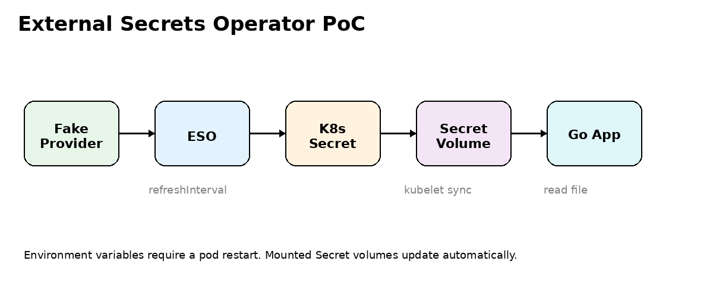

<p align="center">
  
</p>

<h1 align="center">External Secrets Operator Playground</h1>

<p align="center">
An Open Source Proof of Concept demonstrating Kubernetes secret synchronization using External Secrets Operator.
</p>

<p align="center">


</p>

---

# 📖 Overview

This Proof of Concept demonstrates how **External Secrets Operator (ESO)** synchronizes secrets from an external provider into Kubernetes Secrets.

It also demonstrates how applications consuming **mounted Secret volumes** automatically detect secret updates **without requiring a Pod restart**.

---

# 🏗️ Architecture



---

# 🎯 Objective

This Proof of Concept demonstrates how to:

- Synchronize secrets from an external provider.
- Automatically create Kubernetes Secrets.
- Consume secrets through mounted Secret volumes.
- Rotate secrets without restarting application Pods.

---

# ⚙️ Prerequisites

- Docker Desktop (Kubernetes enabled)
- kubectl
- Helm 3
- Docker

---

# 📦 Install External Secrets Operator

Add the Helm repository:

```bash
helm repo add external-secrets https://charts.external-secrets.io
helm repo update
```

Install External Secrets Operator:

```bash
helm install external-secrets external-secrets/external-secrets \
  -n external-secrets \
  --create-namespace \
  --set installCRDs=true
```

---

# 🔒 Deploy the Demo Environment

Deploy the fake provider and External Secret resources:

```bash
kubectl apply -f eso-test.yaml
```

---

# 🔍 Verification

Verify that External Secrets Operator is running:

```bash
kubectl get pods -n external-secrets
```

Verify that the CRDs have been installed:

```bash
kubectl get crd | grep external-secrets
```

Verify that the External Secret has been synchronized:

```bash
kubectl get externalsecret -n eso-test
```

Verify the generated Kubernetes Secret:

```bash
kubectl get secret demo-k8s-secret \
  -n eso-test \
  -o jsonpath='{.data.DB_PASSWORD}' | base64 -d
```

Expected output:

```text
super-local-password
```

---

# 🏗️ Build the Demo Application

Build the Docker image:

```bash
docker build -t eso-logger:local .
```

---

# 🚀 Deploy the Demo Application

Deploy the application:

```bash
kubectl apply -f eso-logger.yaml
```

Follow the application logs:

```bash
kubectl logs -n eso-test deploy/eso-logger -f
```

Expected output:

```text
DB_PASSWORD=super-local-password
```

---

# 🧪 Testing

Update the password inside **eso-test.yaml**:

```yaml
value: super-local-password-changed
```

Apply the updated configuration:

```bash
kubectl apply -f eso-test.yaml
```

Verify that the Kubernetes Secret has been updated:

```bash
kubectl get secret demo-k8s-secret \
  -n eso-test \
  -o jsonpath='{.data.DB_PASSWORD}' | base64 -d
```

Expected output:

```text
super-local-password-changed
```

Continue watching the application logs:

```bash
kubectl logs -n eso-test deploy/eso-logger -f
```

Expected output:

```text
DB_PASSWORD=super-local-password
DB_PASSWORD=super-local-password
DB_PASSWORD=super-local-password-changed
```

---

# 🐳 Docker Desktop Note

Some Docker Desktop Kubernetes installations cannot access locally built images and may return:

```text
ErrImageNeverPull
```

If this happens, push the image to the temporary **ttl.sh** registry:

```bash
IMAGE=ttl.sh/eso-logger-$RANDOM:1h

docker tag eso-logger:local $IMAGE
docker push $IMAGE

kubectl set image deployment/eso-logger eso-logger=$IMAGE -n eso-test

kubectl patch deployment eso-logger -n eso-test \
  -p '{"spec":{"template":{"spec":{"containers":[{"name":"eso-logger","imagePullPolicy":"Always"}]}}}}'
```

Verify the rollout:

```bash
kubectl rollout status deployment/eso-logger -n eso-test

kubectl logs -n eso-test deploy/eso-logger -f
```

---

# 📚 What You Will Learn

After completing this Proof of Concept, you will understand how to:

- Install External Secrets Operator using Helm.
- Synchronize secrets from an external provider.
- Automatically generate Kubernetes Secrets.
- Mount Kubernetes Secrets as volumes.
- Rotate secrets without restarting Pods.
- Apply Kubernetes secret management best practices.

---

# 🧹 Cleanup

Delete the application:

```bash
kubectl delete -f eso-logger.yaml --ignore-not-found
```

Delete the External Secret resources:

```bash
kubectl delete -f eso-test.yaml --ignore-not-found
```

Delete the test namespace:

```bash
kubectl delete namespace eso-test --ignore-not-found
```

Uninstall External Secrets Operator:

```bash
helm uninstall external-secrets -n external-secrets

kubectl delete namespace external-secrets --ignore-not-found
```

(Optional) Remove the local Docker image:

```bash
docker rmi eso-logger:local
```

---

# 📚 References

- https://external-secrets.io
- https://external-secrets.io/latest/

---

# 🏛 About OpenMind Systems Lab

OpenMind Systems Lab is an independent French non-profit association dedicated to research, experimental development and technical benchmarking in Cloud Native technologies.

Our mission is to produce practical, reproducible and educational Open Source Proofs of Concept covering Kubernetes, Platform Engineering, Distributed Messaging, Infrastructure Security and Artificial Intelligence.

GitHub Organization:

https://github.com/openmind-systems-lab

---

<p align="center">
Made with ❤️ by OpenMind Systems Lab
</p>
